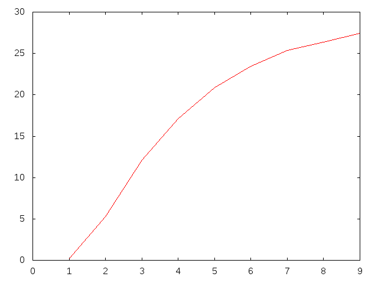

PHYS2200FiveDimSE
=================

Volume of Five-dimensional superellipsoid
-----------------------------------------

This program uses monte-carlo integration to approximate the volume of a five-dimensional superellipsoid, with the following formula:

a^n + b^n + c^n + d^n + e^n = 1

Where n is some constant (I will get to this later). 

To achieve this goal, the MISER method was used from the GSL's Monte-Carlo Integration toolbox. This five-dimensional shape can fit into a five-dimensional "cube" with side lengths of 2. This "cube" has a "volume" of 2^5. The function f(a, b, c, d, e) would return 1 under the following condition: a^n + b^n + c^n + d^n + e^n <= 1 (that is, if it was inside the shape). Otherwise, it would return 0. Then, the volume was estimated by multiplying the integral by 2^5. 

The volume of the superellipsoid was plotted versus the constant n, for n = 1, 2, ...., 9. Not suprisingly, as n increased, the volume of the shape approached the volume of the cube containing it (2^5 units). 

The following was the result of this plot:

